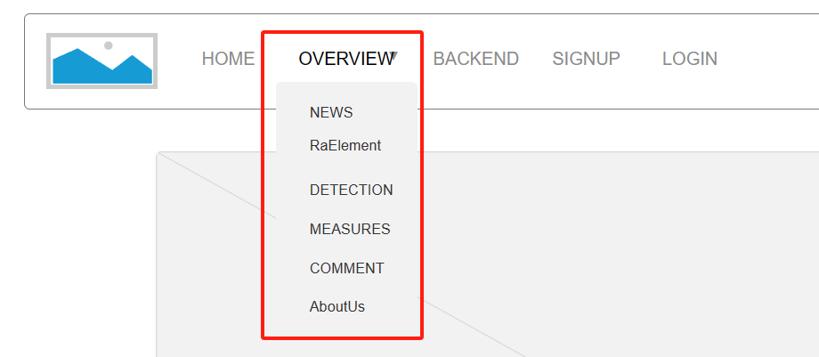

# Hw-02 Web 前端设计

> 武桐西 2112515

## 作业要求

1. 使用Axure等软件设计某个页面

2. 为团队选取一个前台及后台模板

## 一、页面设计

在 [Axure](https://www.axure.com/) 官网下载。虽然该软件收费，但是仍然可以选择免费30天试用。

### 主页面设计

对于 Home 页面，主要设计如下：

1. **导航栏的设置**：主页页眉设计为导航栏，从左至右依次包含：网站Logo、主页HOME、网站总览OVERVIEW、后端管理BACKEND、注册SIGNUP、登录LOGIN等。这样设计简洁明了，便于用户迅速理清前端网站页面结构，有利于用户快速寻找到自己需要的信息。

   除此以外，还包括搜索框与搜索按钮、用户登录后的用户头像等。

2. **网站Logo与HOME图标**：二者被点击时，均触发对主页URL的重新请求访问，达到快速返回主页面Home，并重新刷新主页面的目的。

3. **网页总览OVERVIEW**：该导航块是网页的总览，单机后会调转到网站的纵览页，该页面会显示网站的主要内容。

   同时，鼠标悬浮在该图标上，会分主题显示网站的其他详情内容。

   

4. 进入主页，首先会有一个视野范围内的滑动的与网站主题相关的图片，并采用轮播方式进行展示。

后面的部分主要是网站的主要内容，采用**分页**展示。

## 二、前端页面前台模板

[前端页面前台模板](https://sc.chinaz.com/mobandemo.aspx?downloadid=29202393645155)

其效果如下：

## 三、前端页面后台模板

[前端页面后台模板](https://github.com/PanJiaChen/vue-element-admin)

其效果如下：

