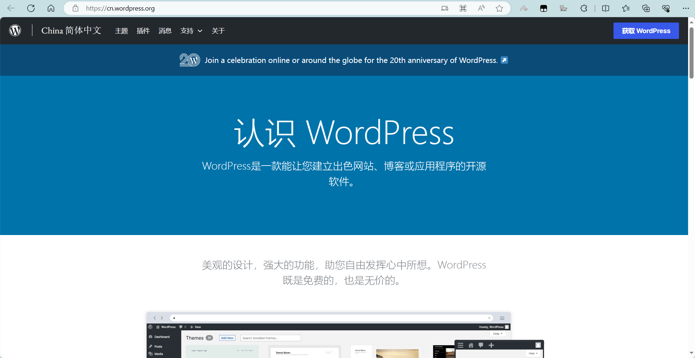
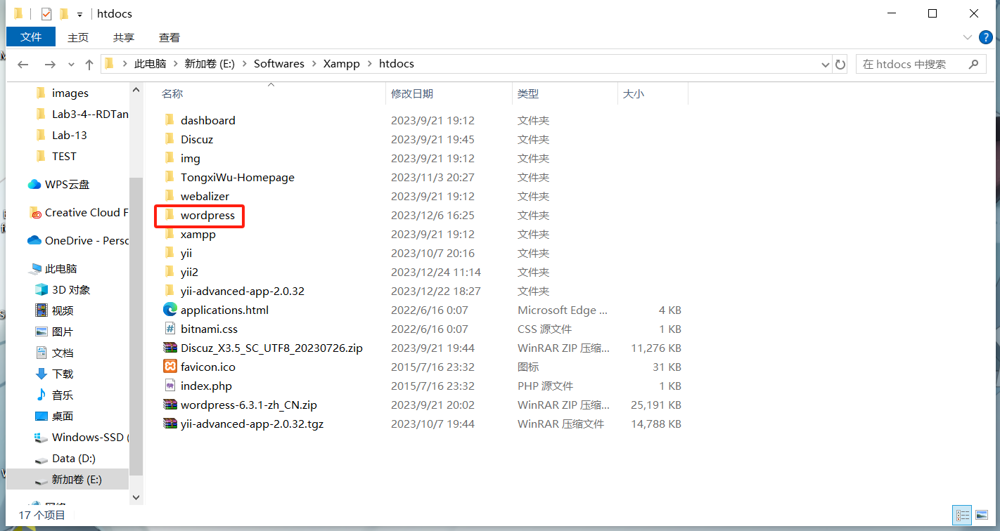
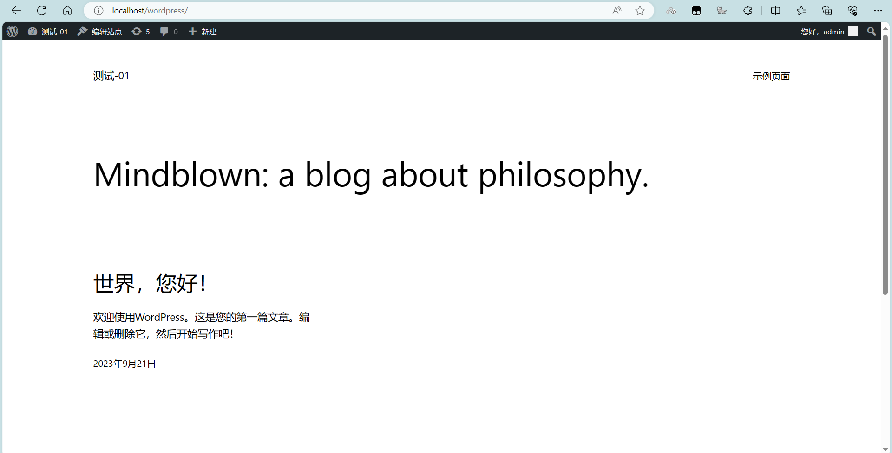
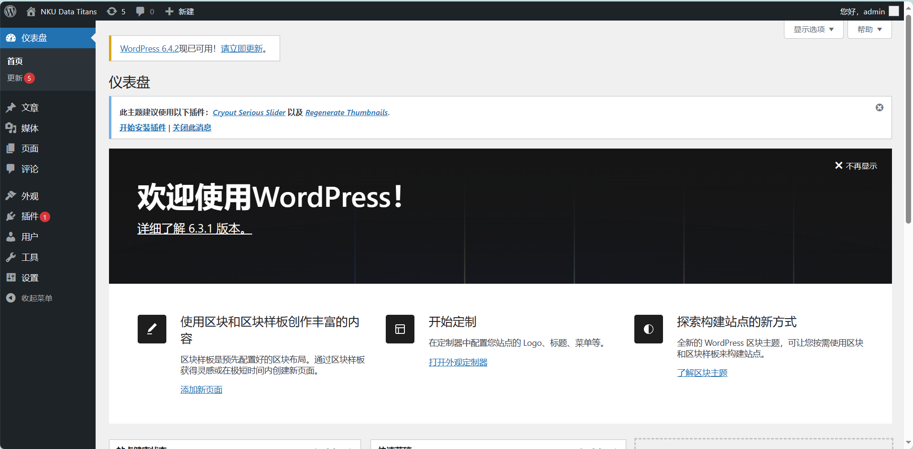
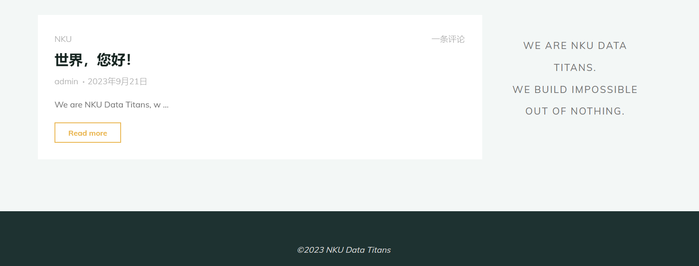
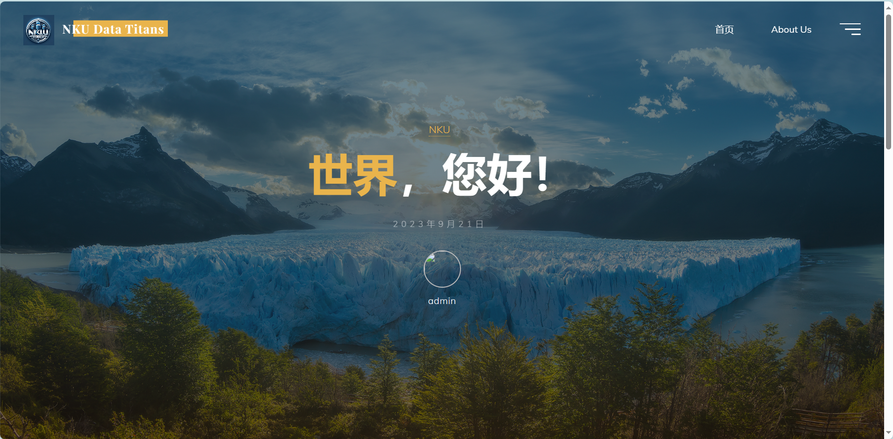

# Hw-03 开源建站工具初试

> 武桐西 2112515

## 作业要求

1. 自行安装WordPress并随意安装模块、设计布局

2. 记录安装步骤及最终页面

## 一、WordPress安装

在 [WordPress](https://cn.wordpress.org/) 官网下载。

由于之前已经下载并安装过 Xampp。因此这里将下载后的安装包解压后放置到 Xampp 的 htdocs 子目录下。

打开 Xampp，启动 Apache 和 MySQL 服务。

浏览器地址栏输入 `localhost/wordpress` 即可访问。首次访问时需要进行一些初始化操作（包括数据库创建与数据库连接），由于笔者之前已经配置过，因此这里不再展示。

输入 `localhost/wordpress` ，访问 本地部署的 WordPress 网站的主页，如下。

## 二、WordPress模块安装与布局设计

使用管理员账户 adimin 登录后，访问管理员页面（`localhost/wordpress/wp-admin`），可以对网站进行编辑，比如布局设计、模块安装等。

通过管理员 admin，进入后台，可以对网站的页面布局、外观设计、模块组件、文章内容（因为WordPress是一个搭建博客类网站的快速建站工具CMS）等。

后台页面如下：

## 三、最终效果呈现

经过一系列设计，最终的页面效果呈现如下：

主页面：

主页页眉图片能够**循环播放**，并且主页页眉文字具有**动态效果**。

除此之外，每一个UI交互（当鼠标悬浮 `hover` 在其上时），会有**动态效果**的呈现。

主页呈现的主要内容是本网站的最新的文章（按时间顺序排序）。

右侧小控件是一段我们团队（[NKU Data Titans](https://github.com/NKU-Data-Titans)）的标语。

About Us 界面：

基本效果和主页相同。

其主要内容是关于我们团队（[NKU Data Titans](https://github.com/NKU-Data-Titans)）的简介，以及一段笔者非常喜欢的名言（引自庞加莱）：

文章页面的展示：

可以对文章发表评论：

评论展示：

